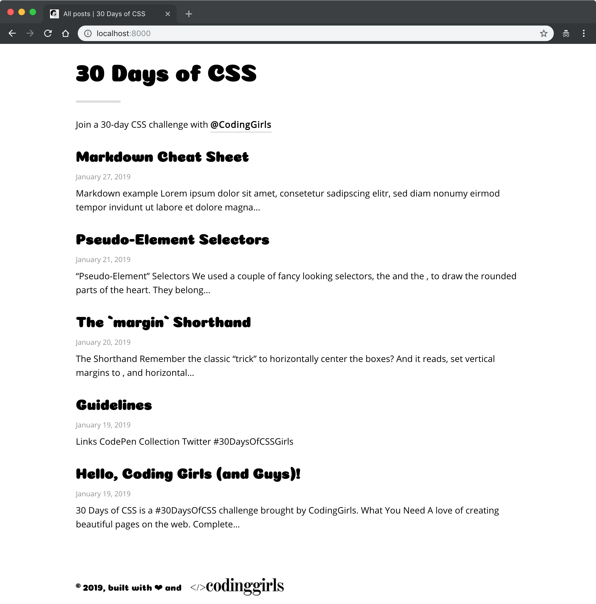

# Coding Girls (Typography)

Typography used by the Coding Girls' [#30DaysOfCSSGirls](https://twitter.com/search?f=tweets&q=%2330DaysOfCSSGirls) static site.

## Theme

I apologize for the crudeness of the screenshots. I'll refine them later.

- List

  

- Code

  

- Blockquote

  

- ul

  

## Typography

We're girls. We love it cute.

- Headers: [Coiny](https://fonts.google.com/specimen/Coiny)
- Text: [Open Sans](https://fonts.google.com/specimen/Open+Sans)
- Quotes: [Aleo](https://fonts.google.com/specimen/Aleo)

## Usage

```console
$ yarn add coding-girls-typography
```

Directly import in your app.

```js
// index.js of your app
import "coding-girls-typography";
```

Will distribute `.min.css`, and support [`typography.js`](https://www.gatsbyjs.org/docs/typography-js/) for [Gatsby](https://www.gatsbyjs.org/) later.
